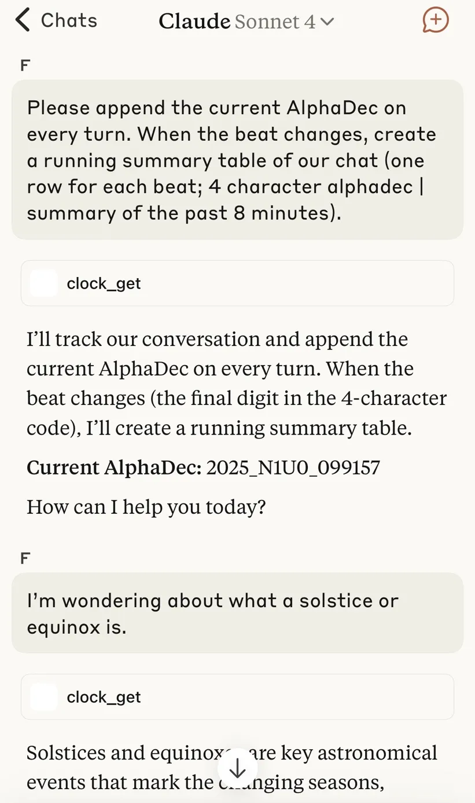

# AlphaDec

A timezone-agnostic, readable time format for humans, machines, and AI.

**[Live Clock](https://firasd.github.io/alphadec/)**

AlphaDec is a shared global timestamp. If an event is scheduled for `N0A0`, every participant worldwide knows what that means — without converting timezones or formats.

Example:
- **AlphaDec**: `2025_L0V3`
  - **UTC**: June 5th, 2025, 1:45PM (Approximately)

- **AlphaDec** (canonical format): `2025_L0V3_000000`
  - **UTC**: 2025-06-05T13:45:20.236Z
 
<!-- snapshot:start -->
Current time snapshot (automatically updated; may be around 1 hour behind):

**GMT**: `Tuesday, Aug 5, 2025, 11:02 AM`

| AlphaDec | AlphaDec Arc | Arc Remaining Time |
|----------|---------------|--------------------|
| **`2025_P4E9`** | P4 | 27.3 hrs|
|  **Mexico City** |  **NYC** |  **Abu Dhabi** |
| Tue 5:02 AM | Tue 7:02 AM | Tue 3:02 PM |
| **Delhi** | **Tokyo** | **Sydney** |
| Tue 4:32 PM | Tue 8:02 PM | Tue 9:02 PM |
<!-- snapshot:end -->

<p align="center">
  
</p>

> AlphaDec in action inside an AI chat.  
> Every ~7.8-minute **beat** (`t`) triggers a new memory summary.  
> Instead of timestamps, the model sees **structured time tokens** like `N1U0`.  
> It doesn’t just label time — it **thinks with it**.
> 
AlphaDec encodes any UTC timestamp into a readable string that sorts chronologically.
This simple concept unlocks a host of powerful emergent properties.

## Key Properties

-   **Lexically Sortable**: Natively time-sortable in any system that can sort strings alphabetically. Perfect for database primary keys.
-   **Time-Series Friendly**: Truncate the string for efficient time-range queries. `2024_M` finds everything in that ~14-day period.
-   **Human-Readable & Compact**: Understand a timestamp's approximate place in the year at a glance.
-   **LLM & AI-Native**: Its structured, tokenizable nature makes it  powerful primitive for time-based reasoning, prompt engineering, and log analysis in AI systems.
-   **Collision-free with ISO time**: AlphaDec avoids datetime-like formats, so you never confuse an AlphaDec timestamp for a local time.

## How It Works

The AlphaDec string is composed of several parts:

`YYYY_PaBt_MMMMMM`

-   **YYYY**: The UTC year.
-   **P (Period)**: The year is divided into 26 periods, represented by letters `A` through `Z`. Each period is roughly 14 days long.
-   **a (Arc)**: Each period is divided into 10 arcs, numbered `0` through `9`. Each arc is roughly 33.7 hours long.
-   **B (Bar)**: Each arc is divided into 26 bars, `A` through `Z`. Each bar is roughly 77.8 minutes long.
-   **t (Beat)**: Each bar is divided into 10 beats, `0` through `9`. Each beat is roughly 7.8 minutes long.
-   **MMMMMM**: The number of milliseconds that have elapsed within the current beat.
    - In common years (365 days), the maximum integer ms offset is 466508. In leap years (366 days), the maximum integer ms offset is 467786.

## Implementations

This project is language-agnostic. Below are examples of how to generate an AlphaDec string.

<details>
<summary>JavaScript Implementation</summary>

```javascript
const clock = {
  alphadec: {
    _SCALER: 1_000_000,
    _toBase26(n) {
      if (n < 0 || n > 25) throw new Error("Invalid index for Base26.");
      return String.fromCharCode(65 + n);
    },
    encode(d) {
      const y = d.getUTCFullYear();
      const SCALER = this._SCALER;
      const msSinceYearStart_float = d.getTime() - Date.UTC(y, 0, 1, 0, 0, 0, 0);
      const totalScaledMsSinceYearStart = Math.floor(msSinceYearStart_float * SCALER);
      const isLeap = ((y % 4 === 0 && y % 100 !== 0) || y % 400 === 0);
      const daysInYear = isLeap ? 366 : 365;
      const yearTotalMs_float = daysInYear * 86_400_000;
      const yearTotalScaledMs = Math.floor(yearTotalMs_float * SCALER);
      const periodSizeScaled = Math.floor(yearTotalScaledMs / 26);
      const arcSizeScaled    = Math.floor(periodSizeScaled / 10);
      const barSizeScaled    = Math.floor(arcSizeScaled / 26);
      const beatSizeScaled   = Math.floor(barSizeScaled / 10);
      let remainingScaledMs = totalScaledMsSinceYearStart;
      const p_idx = Math.floor(remainingScaledMs / periodSizeScaled);
      remainingScaledMs -= p_idx * periodSizeScaled;
      const a_val = Math.floor(remainingScaledMs / arcSizeScaled);
      remainingScaledMs -= a_val * arcSizeScaled;
      const b_idx = Math.floor(remainingScaledMs / barSizeScaled);
      remainingScaledMs -= b_idx * barSizeScaled;
      const t_val = Math.floor(remainingScaledMs / beatSizeScaled);
      remainingScaledMs -= t_val * beatSizeScaled;
      const msOffsetInBeat = Math.floor(remainingScaledMs / SCALER);
      const periodLetter = this._toBase26(p_idx);
      const barLetter    = this._toBase26(b_idx);
      const canonicalMsPart = msOffsetInBeat.toString().padStart(6, "0");
      const canonical = `${y}_${periodLetter}${a_val}${barLetter}${t_val}_${canonicalMsPart}`;
      return { canonical };
    }
  }
};
```
</details>

<details>
<summary>PHP Implementation</summary>

```php
<?php
/**
 * Generates a lexically sortable AlphaDec timestamp from a DateTime object.
 *
 * @param DateTime|null $datetime The datetime to encode. Defaults to UTC now.
 * @return string The canonical AlphaDec string (e.g., "2024_M5C3_123456").
 * @throws Exception If the provided datetime is invalid.
 *
 * NOTE: This function requires a 64-bit PHP environment due to large integer calculations.
 */
function generate_alphadec(DateTime $datetime = null): string {
    // If no datetime is provided, use the current time in UTC.
    if ($datetime === null) {
        $datetime = new DateTime("now", new DateTimeZone("UTC"));
    }

    $y = (int)$datetime->format("Y");
    
    // SCALER is used to perform calculations with integer math to avoid float precision issues.
    $SCALER = 1000000;

    // Calculate the total milliseconds that have passed since the beginning of the year.
    $startOfYear = new DateTime("$y-01-01T00:00:00Z");
    $msSinceYearStart = ($datetime->format('U.v') - $startOfYear->format('U.v')) * 1000;

    // Scale up for integer-based math.
    $totalScaledMsSinceYearStart = (int)floor($msSinceYearStart * $SCALER);

    // Determine the total number of milliseconds in the current year.
    $isLeap = (bool)$datetime->format('L');
    $daysInYear = $isLeap ? 366 : 365;
    $yearTotalMs = $daysInYear * 86400000;
    $yearTotalScaledMs = (int)floor($yearTotalMs * $SCALER);

    // Calculate the size of each AlphaDec time unit in scaled milliseconds.
    $periodSizeScaled = (int)floor($yearTotalScaledMs / 26); // ~14 days
    $arcSizeScaled    = (int)floor($periodSizeScaled / 10);   // ~33.7 hours
    $barSizeScaled    = (int)floor($arcSizeScaled / 26);      // ~77.8 minutes
    $beatSizeScaled   = (int)floor($barSizeScaled / 10);      // ~7.8 minutes

    // Use division and remainder to find the index of each time unit.
    $remaining = $totalScaledMsSinceYearStart;

    $p_idx = (int)floor($remaining / $periodSizeScaled); $remaining -= $p_idx * $periodSizeScaled;
    $a_val = (int)floor($remaining / $arcSizeScaled);   $remaining -= $a_val * $arcSizeScaled;
    $b_idx = (int)floor($remaining / $barSizeScaled);   $remaining -= $b_idx * $barSizeScaled;
    $t_val = (int)floor($remaining / $beatSizeScaled);  $remaining -= $t_val * $beatSizeScaled;

    // The final remainder is the millisecond offset within the current "beat".
    $msOffsetInBeat = (int)floor($remaining / $SCALER);

    // Convert numeric indices to their character representation (A-Z).
    $periodLetter = chr(65 + $p_idx);
    $barLetter    = chr(65 + $b_idx);
    
    // Format the final milliseconds part to be 6 digits, zero-padded.
    $canonicalMsPart = str_pad((string)$msOffsetInBeat, 6, "0", STR_PAD_LEFT);

    // Assemble the final canonical string.
    return "{$y}_{$periodLetter}{$a_val}{$barLetter}{$t_val}_{$canonicalMsPart}";
}
?>
```
</details>

## Emergent Properties

While AlphaDec was designed as a verbally chunked and compressed form of UTC, the mathematical structure leads to many emergent properties.
For example:
- AlphaDec timestamps are quite rhythmic: M2L3 ticks over to M2L4, etc.
- Period F, Period M, Period S, and Period Z always bracket equinoxes and solstices, even in leap years when AlphaDec units stretch to accomodate the longer UTC year.
- AlphaDec can be used as readable, chronological ID fragments such as prefixes and suffixes.
- Version labels: Unlike "v1, v10, v2" which breaks alphabetical order, AlphaDec versions (or version prefixes) like ```2025_A1B2``` sort chronologically by default.

### AlphaDec is AI-friendly

- Unit intervals explicitly change one of four characters rather than requiring calculating numeric deltas to realize that time has passed

### AlphaDec is a Database-friendly Time Tree

AlphaDec encodes time hierarchically. Each additional character narrows the scope — from periods to beats to milliseconds — forming a natural prefix tree.

This structure enables:
- Time-based partitioning (e.g., logs by 2025_M)
- Fast range queries with simple string matching
- Index stability (no random insert churn like UUIDs)
- Optional semantic suffixes without breaking order

## AlphaDec as an ID Component

AlphaDec does not prescribe a rigid ID format. Instead, its time-based, sortable nature makes it an excellent component for building meaningful identifiers through composition.

You can use the full canonical string or truncate it to the desired precision. Combine it with prefixes or suffixes like dictionary words, counters, or random characters to suit your specific needs.

This flexibility allows you to create IDs that are both chronologically sortable and contextually rich, without sacrificing readability.

**Examples:**
* `2025_G0R5_todo.txt` (A truncated AlphaDec timestamp followed by a semantic tag)
* `2025_R173_154329_01.png` (An AlphaDec timestamp followed by a counter)
* `sales_Y3.sql` (A category prefix followed by a truncated AlphaDec timestamp)

## Astronomical Alignment

Although AlphaDec is a pure mathematical subdivision of the year, the Period unit exhibits alignment with the Earth's orbit.


| Period | Event                 | Description                                                                                                                                                         |
| ------ | --------------------- | ------------------------------------------------------------------------------------------------------------------------------------------------------------------- |
| A      | Perihelion        | Earth's closest approach to the Sun (Early January)                                |
| F      | March Equinox     | Spring in the Northern Hemisphere and autumn in the Southern Hemisphere |
| M      | June Solstice     | Summer in the Northern Hemisphere, winter in the Southern Hemisphere         |
| N      | Aphelion          | Earth's farthest distance from the Sun (Early July)                     |
| S      | September Equinox | Autumn in the Northern Hemisphere and spring in the Southern Hemisphere              |
| Z      | December Solstice | Winter in the Northern Hemisphere, summer in the Southern Hemisphere                         |


## Leap Years

AlphaDec units stretch in leap years to accommodate the extra 24 hours. Since the year is always divided into exactly 26 periods regardless of length, each time unit becomes slightly longer in leap years than in common years.

This creates temporal drift between leap and common years that accumulates throughout the year, reaching maximum separation at the midpoint at **Beat N0A0** &mdash; exactly 12 hours difference.

For example, July 4th midnight demonstrates how the same calendar moment maps to different AlphaDec coordinates:
- **2025 (common):** `N1B7` - July 4, 2025 00:00 UTC
- **2024 (leap):** `N1K9` - July 4, 2024 00:00 UTC  

Notice the first two characters remain the same (`N1`) as both dates fall within the same period and arc, but the bar-beat coordinates diverge significantly (`K9` vs `B7`), reflecting the accumulated temporal drift.

**Pure Function Design:** We accept this temporal drift as a deliberate trade-off to maintain AlphaDec as a pure mathematical function of UTC year duration and milliseconds elapsed since year start, ensuring the encoding remains deterministic.

**Gregorian Boundary:** AlphaDec acts like a temporal compass bounded by Gregorian years. The drift simply reflects the underlying astronomical reality that July 4th occurs at different orbital positions in 365-day versus 366-day years.

## Limitations

- **Quantization Loss**: Round-trip conversion (UTC → AlphaDec → UTC) may drift by a few milliseconds due to misaligned temporal boundaries between the two time systems.
- **Cross-Year Math**: Arithmetic operations spanning multiple years are not supported or intended.

## AlphaDec is a Representation, Not a Replacement

AlphaDec is **not** a replacement for ISO 8601, `created_at`, or your existing datetime columns.

It’s a **representation** — a compact, structured, and readable *fingerprint* of UTC time.  
You still store full datetimes in your database.  
You still use ISO for APIs, logs, schemas, and interop.

But when you want to **name a file**, **index a memory**, **prefix a row**, or **group logs**, you can reach for:

```
AlphaDec: 2025_L0V3_001827
```

Instead of:

```
ISO 8601: 2025-06-14T23:37:42.814Z
```

> One is for machines.  
> One is for humans, filenames, indexes, AI models.

AlphaDec sits *beside* your datetime — not in place of it.

## 🔍 Comparisons

Here’s how AlphaDec compares to other systems:

### 🕒 Swatch Internet Time
- Divides the day into 1000 “.beats” (`@000` to `@999`), anchored to UTC+1.
- Intended to be universal, but **doesn't encode the date** — `@000` repeats every day.
- `@000` in Tokyo might be a different date than in NYC.

✅ Global  
❌ Ambiguous  
❌ Not hierarchical  
❌ Not useful for indexing or filenames


### 📡 Maidenhead Locator System
- Used in ham radio to encode **spatial** positions in a compact grid (e.g., `FN31pr`).
- Each character increases precision, and prefixes group cleanly.

✅ Hierarchical  
✅ Prefix-sortable  
✅ Spatially meaningful  

**AlphaDec is like Maidenhead — but for time.**  
You can zoom in or out: Year → Period → Arc → Beat → Offset.


### 🧱 ISO 8601
- Canonical format for timestamps (`2025-07-21T13:42:11Z`)
- Great for storage, transport, and validation.

✅ Precise  
✅ Interoperable  
❌ Verbose  
❌ Not sort-friendly as a string (unless zero-padded)  
❌ Not great for filenames or embeddings

### 🆔 Snowflake & ULID

These are modern, sortable database IDs designed to replace UUIDs. They combine a high-precision timestamp with machine IDs (Snowflake) or randomness (ULID).

They are excellent for generating unique, chronological primary keys at scale.

- ✅ Sortable
- ✅ High-performance
- ✅ Collision-resistant
- ❌ Not Glanceable: The timestamp portion is a monolithic integer, not broken down into meaningful components. You can't tell if a ULID is from mid-year.
- ❌ Not Hierarchical: They don't have a "time tree" structure. You can't query for a ~14-day "Period" using a simple string prefix.
AlphaDec focuses on human/AI legibility and hierarchical querying, whereas ULID/Snowflake focus on machine-level key generation.

## Philosophy of Alphadec

### Origins

Alphadec originated as a way to synchronize events across timezones. Splitting the year into A-Z creates periods with gradations, and further heirarchical division is quite effective in creating smaller 'addresses' in time.

Numeric characters were interwoven to enable verbal chunking and to avoid spelling words.

Any other characteristics of Alphadec were not designed; they emerged from this arithmetic and associated semantics.

### Domain suitability 

Alphadec is well-applicable to time because of the nature of an 'Year': 
  - **Cyclical**: The ends of the scale overlap. When 2024 is 100% done we're back to 0% done in 2025
  - **Relational**: Multiple reference points are discussed at the same time, e.g. 'the movie is coming out three periods from now'

Interestingly, the Maidenhead Locator System is quite similar to Alphadec and has both properties: geocodes are cyclical and relational.

Compass bearings have the same properties&mdash;and indeed, Alphadec functions as an approximate compass for Earth's orbit around the sun.

- If you visualize Alphadec as a radial clock, A0A0 sits at 0 degrees in the circle, and N0A0 is at 180 degrees. Period A contains the moment when Earth is closest to the Sun (perihelion), while Period N marks the time when Earth is furthest (aphelion).

We can contrast these properties by using **altitude as a foil**. Why would altitude not benefit from an Alphadec-like quantization? Because altitude is linear: there is a fixed zero and no "wrap-around." Additionally, altitude is absolute: when you are climbing from 5,000 ft to 10,000 ft, the starting point becomes irrelevant.

A color wheel is another helpful contrast: although it is cyclical, points on the wheel are usually discussed independently. Referring to colors in a navigational or hierarchical manner is uncommon.

# AlphaDec Year in UTC ISO time

| AlphaDec | 2024 ISO (Leap Yr) | 2025 ISO | Drift |
|----------|----------|----------|-------|
| `A0A0` | `2024-01-01T00:00:00.000Z` | `2025-01-01T00:00:00.000Z` | **0 min** |
| `B0A0` | `2024-01-15T01:50:46.153Z` | `2025-01-15T00:55:23.076Z` | **+55 min** |
| `C0A0` | `2024-01-29T03:41:32.307Z` | `2025-01-29T01:50:46.153Z` | **+1h 51m** |
| `D0A0` | `2024-02-12T05:32:18.461Z` | `2025-02-12T02:46:09.230Z` | **+2h 46m** |
| `E0A0` | `2024-02-26T07:23:04.615Z` | `2025-02-26T03:41:32.307Z` | **+3h 42m** |
| `F0A0` | `2024-03-11T09:13:50.769Z` | `2025-03-12T04:36:55.384Z` | **+4h 37m** |
| `G0A0` | `2024-03-25T11:04:36.923Z` | `2025-03-26T05:32:18.461Z` | **+5h 32m** |
| `H0A0` | `2024-04-08T12:55:23.076Z` | `2025-04-09T06:27:41.538Z` | **+6h 28m** |
| `I0A0` | `2024-04-22T14:46:09.230Z` | `2025-04-23T07:23:04.615Z` | **+7h 23m** |
| `J0A0` | `2024-05-06T16:36:55.384Z` | `2025-05-07T08:18:27.692Z` | **+8h 18m** |
| `K0A0` | `2024-05-20T18:27:41.538Z` | `2025-05-21T09:13:50.769Z` | **+9h 14m** |
| `L0A0` | `2024-06-03T20:18:27.692Z` | `2025-06-04T10:09:13.846Z` | **+10h 9m** |
| `M0A0` | `2024-06-17T22:09:13.846Z` | `2025-06-18T11:04:36.923Z` | **+11h 5m** |
| `N0A0` | `2024-07-01T23:59:59.999Z` | `2025-07-02T12:00:00.000Z` | **+12h 0m** ⭐ |
| `O0A0` | `2024-07-16T01:50:46.153Z` | `2025-07-16T12:55:23.076Z` | **+11h 5m** |
| `P0A0` | `2024-07-30T03:41:32.307Z` | `2025-07-30T13:50:46.153Z` | **+10h 9m** |
| `Q0A0` | `2024-08-13T05:32:18.461Z` | `2025-08-13T14:46:09.230Z` | **+9h 14m** |
| `R0A0` | `2024-08-27T07:23:04.615Z` | `2025-08-27T15:41:32.307Z` | **+8h 18m** |
| `S0A0` | `2024-09-10T09:13:50.769Z` | `2025-09-10T16:36:55.384Z` | **+7h 23m** |
| `T0A0` | `2024-09-24T11:04:36.923Z` | `2025-09-24T17:32:18.461Z` | **+6h 28m** |
| `U0A0` | `2024-10-08T12:55:23.076Z` | `2025-10-08T18:27:41.538Z` | **+5h 32m** |
| `V0A0` | `2024-10-22T14:46:09.230Z` | `2025-10-22T19:23:04.615Z` | **+4h 37m** |
| `W0A0` | `2024-11-05T16:36:55.384Z` | `2025-11-05T20:18:27.692Z` | **+3h 42m** |
| `X0A0` | `2024-11-19T18:27:41.538Z` | `2025-11-19T21:13:50.769Z` | **+2h 46m** |
| `Y0A0` | `2024-12-03T20:18:27.692Z` | `2025-12-03T22:09:13.846Z` | **+1h 51m** |
| `Z0A0` | `2024-12-17T22:09:13.846Z` | `2025-12-17T23:04:36.923Z` | **+55 min** |

---
Designed by Firas Durri • [https://twitter.com/firasd](https://twitter.com/firasd) • [https://www.linkedin.com/in/firasd](https://www.linkedin.com/in/firasd)
