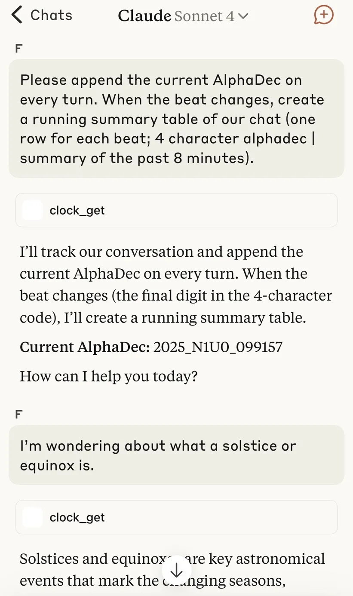

# Alphadec: a Time ID system

A timezone-agnostic, readable time format for humans, machines, and AI.

**[Live Clock](https://firasd.github.io/alphadec/)**

AlphaDec is a shared global timestamp. If an event is scheduled for `N0A0`, every participant worldwide knows what that means — without converting timezones or formats.

Example:
- **AlphaDec**: `2025_L0V3`
  - **UTC**: June 5th, 2025, 1:45PM (Approximately)

- **AlphaDec** (canonical format): `2025_L0V3_000000`
  - **UTC**: 2025-06-05T13:45:20.236Z
 
<!-- snapshot:start
Current time snapshot (automatically updated; may be around 1 hour behind):

**GMT**: `Tuesday, Sep 16, 2025, 11:10 AM`

| AlphaDec | AlphaDec Arc | Arc Remaining Time |
|----------|---------------|--------------------|
| **`2025_S4C9`** | S4 | 29.9 hrs|
|  **Mexico City** |  **NYC** |  **Abu Dhabi** |
| Tue 5:10 AM | Tue 7:10 AM | Tue 3:10 PM |
| **Delhi** | **Tokyo** | **Sydney** |
| Tue 4:40 PM | Tue 8:10 PM | Tue 9:10 PM |
<!-- snapshot:end -->

<p align="center">
  
</p>

> AlphaDec in action inside an AI chat.  
> Every ~7.8-minute **beat** (`t`) triggers a new memory summary.  
> Instead of timestamps, the model sees **structured time tokens** like `N1U0`.  
> It doesn’t just label time — it **thinks with it**.
> 
AlphaDec encodes any UTC timestamp into a readable string that sorts chronologically.
This simple concept unlocks a host of powerful emergent properties.

## Key Properties

-   **Lexically Sortable**: Natively time-sortable in any system that can sort strings alphabetically. Perfect for database primary keys.
-   **Time-Series Friendly**: Truncate the string for efficient time-range queries. `2024_M` finds everything in that ~14-day period.
-   **Human-Readable & Compact**: Understand a timestamp's approximate place in the year at a glance.
-   **LLM & AI-Native**: Its structured, tokenizable, continuous rhythm makes it a powerful primitive for giving AI a sense for how time is passing.
-   **Collision-free with ISO time**: AlphaDec avoids datetime-like formats, so you never confuse an AlphaDec timestamp for a local time (a past Alphadec is the same 'time ago' for everyone).

## How It Works

The canonical AlphaDec string is composed of several parts:

`YYYY_PeriodArcBarBeat_MSOffset`

-   **YYYY**: The UTC year.
-   **Period**: The year is divided into 26 periods, represented by letters `A` through `Z`. Each period is roughly 14 days long.
-   **Arc**: Each period is divided into 10 arcs, numbered `0` through `9`. Each arc is roughly 33.7 hours long.
-   **Bar**: Each arc is divided into 26 bars, `A` through `Z`. Each bar is roughly 77.8 minutes long.
-   **Beat**: Each bar is divided into 10 beats, `0` through `9`. Each beat is roughly 7.8 minutes long.
-   **MsOffset**: The number of milliseconds that have elapsed within the current beat.
    - In common years (365 days), the maximum integer ms offset is 466508. In leap years (366 days), the maximum integer ms offset is 467786.

## Implementation

```javascript
const alphadec = {
	_SCALER_N: 1_000_000n,

	_toBase26(n) {
		if (n < 0 || n > 25) throw new Error("Invalid index for Base26.");
		return String.fromCharCode(65 + n);
	},

	encode(d) {
		const y = d.getUTCFullYear();
		const isLeap = ((y % 4 === 0 && y % 100 !== 0) || y % 400 === 0);
		const daysInYear = isLeap ? 366 : 365;

		const BEATS_IN_YEAR = 67600n;
		const yearTotalMs = BigInt(daysInYear) * 86_400_000n;
		const msSinceYearStart = BigInt(d.getTime() - Date.UTC(y, 0, 1));

		const totalBeatIndex = (msSinceYearStart * BEATS_IN_YEAR) / yearTotalMs;

		const beatStartScaledMs = (yearTotalMs * totalBeatIndex * this._SCALER_N) / BEATS_IN_YEAR;
		const totalScaledMs = msSinceYearStart * this._SCALER_N;

		const scaledMsOffset = totalScaledMs - beatStartScaledMs;
		const msOffsetInBeat = Number(scaledMsOffset / this._SCALER_N);

		let remainingBeats = totalBeatIndex;
		const p_idx = remainingBeats / 2600n;
		remainingBeats %= 2600n;
		const a_val = remainingBeats / 260n;
		remainingBeats %= 260n;
		const b_idx = remainingBeats / 10n;
		const t_val = remainingBeats % 10n;

		const currentArcStartBeats = (p_idx * 2600n) + (a_val * 260n);
		const arcStartScaledMs = (yearTotalMs * currentArcStartBeats * this._SCALER_N) / BEATS_IN_YEAR;
		const arcEndScaledMs = (yearTotalMs * (currentArcStartBeats + 260n) * this._SCALER_N) / BEATS_IN_YEAR;

		const arcStartMsInYear = Number(arcStartScaledMs / this._SCALER_N);
		const arcEndMsInYear = Number(arcEndScaledMs / this._SCALER_N);

		const periodLetter = this._toBase26(Number(p_idx));
		const barLetter = this._toBase26(Number(b_idx));
		const canonicalMsPart = String(msOffsetInBeat).padStart(6, "0");

		const canonical = `${y}_${periodLetter}${a_val}${barLetter}${t_val}_${canonicalMsPart}`;

		return {
			canonical,
			year: y,
			period: Number(p_idx),
			arc: Number(a_val),
			bar: Number(b_idx),
			beat: Number(t_val),
			msOffsetInBeat,
			periodLetter,
			barLetter,
			arcStartMsInYear,
			arcEndMsInYear
		};
	},

	decode(canonical) {
		const m = canonical.match(/^(\d{4})_([A-Z])(\d)([A-Z])(\d)_([0-9]{6})$/);
		if (!m) throw new Error(`Bad Alphadec canonical string: "${canonical}"`);

		const [, yStr, pLtr, aStr, bLtr, tStr, msStr] = m;
		const year = Number(yStr);

		const isLeap = ((year % 4 === 0 && year % 100 !== 0) || year % 400 === 0);

		const msOffsetInBeat = Number(msStr);
		const maxOffset = isLeap ? 467786 : 466508;

		if (msOffsetInBeat > maxOffset) {
			throw new Error(
				`AlphaDec ms offset out of bounds: ${msOffsetInBeat} (max ${maxOffset})`
			);
		}

		const daysInYear = isLeap ? 366 : 365;

		const BEATS_IN_YEAR = 67600n;
		const yearTotalScaledMs = BigInt(daysInYear) * 86_400_000n * this._SCALER_N;
		const pIndex = BigInt(pLtr.charCodeAt(0) - 65);
		const totalBeats =
			(pIndex * 2600n) +
			(BigInt(aStr) * 260n) +
			(BigInt(bLtr.charCodeAt(0) - 65) * 10n) +
			BigInt(tStr);

		const beatStartScaledMs = (yearTotalScaledMs * totalBeats) / BEATS_IN_YEAR;
		const totalScaledMs = beatStartScaledMs + (BigInt(msStr) * this._SCALER_N);

		const totalMsSinceYearStart = totalScaledMs / this._SCALER_N;
		const startOfYearMs = Date.UTC(year, 0, 1);

		return new Date(startOfYearMs + Number(totalMsSinceYearStart));
	}
};
```

The encoder returns both the `canonical` string and all individual components (`year`, `periodLetter`, `arc`, `barLetter`, `beat`, etc.), so consumers can build any truncated form without a separate call:

```javascript
const { year, periodLetter, arc } = alphadec.encode(new Date());
const truncated = `${year}_${periodLetter}${arc}`;  // e.g. "2026_I4"
```

## Emergent Properties

While AlphaDec was designed as a verbally chunked and compressed form of UTC, the mathematical structure leads to many emergent properties.
For example:
- AlphaDec timestamps are quite rhythmic: M2L3 ticks over to M2L4, etc.
- Period F, Period M, Period S, and Period Z always bracket equinoxes and solstices, even in leap years when AlphaDec units stretch to accomodate the longer UTC year.
- AlphaDec can be used as readable, chronological ID fragments such as prefixes and suffixes.
- Version labels: Unlike "v1, v10, v2" which breaks alphabetical order, AlphaDec versions (or version prefixes) like ```2025_A1B2``` sort chronologically by default.

### AlphaDec is AI-friendly

- Unit intervals explicitly change one of four characters rather than requiring calculating numeric deltas to realize that time has passed

### AlphaDec is a Database-friendly Time Tree

AlphaDec encodes time hierarchically. Each additional character narrows the scope — from periods to beats to milliseconds — forming a natural prefix tree.

This structure enables:
- Time-based partitioning (e.g., logs by 2025_M)
- Fast range queries with simple string matching
- Index stability (no random insert churn like UUIDs)
- Optional semantic suffixes without breaking order
 
Because Alphadec stamps are strings, you can use them in more contexts than a standard timestamp&mdash;and unlike `2025-08-11`, the unit sizes on `2025_P8G2` don't jump from 1 day to a full month.

#### The UTC vs. local ISO dilemma

For machine storage, you're choosing between UTC ISO (`2025-04-29T12:00:00Z`) and local ISO with a timezone offset (`2025-04-29T17:30:00+05:30`). UTC ISO is string-sortable but loses the original timezone. Local ISO preserves the timezone but **breaks lexicographic sort** — RFC 3339 offsets like `+05:30`, `-07:00`, and `Z` don't sort correctly as strings because of their ASCII values.

SQLite is a common environment where this bites: it has no native datetime type and sorts timestamp columns as strings. Storing timezone-aware timestamps in SQLite means either discarding the offset or accepting broken sort order. There's no clean solution on the ISO side.

Alphadec is the tiebreaker for the machine side of this tradeoff. It's always UTC-derived (no timezone ambiguity), K-sortable by construction, and visually distinct enough that it's never confused for a local time.

### Alphadec is Self-Documenting

Because AlphaDec is an arithmetic conversion of UTC, the format can be reverse-engineered from just 2-3 sufficiently spaced AlphaDec ↔ UTC pairs, even in an archaeological scenario.

No further external documentation or coordination is required.

## Alphadec as an ID Component

Alphadec does not prescribe a rigid ID format. Instead, its time-based, sortable nature makes it an excellent component for building meaningful identifiers through composition.

You can use the full canonical string or truncate it to the desired precision. Combine it with prefixes or suffixes like dictionary words, counters, or random characters to suit your specific needs.

This flexibility allows you to create IDs that are both chronologically sortable and contextually rich, without sacrificing readability.

**Examples:**
* `2025_G0R5_todo.txt` (A truncated AlphaDec timestamp followed by a semantic tag)
* `2025_R173_154329_01.png` (An AlphaDec timestamp followed by a counter)
* `sales_Y3.sql` (A category prefix followed by a truncated AlphaDec timestamp)

### Alphadec's glyph-like stamp

Consider these filenames prefixed with ISO dates:

- 2025-08-07-screenshot.png
- 2025-10-22-crashlog.txt

And now with Alphadec:

- 2025_P5I6-screenshot.png
- 2025_V0A0-crashlog.txt

Both prefixes sort chronologically, but Alphadec achieves far higher resolution with fewer characters: setting aside underscores and hyphens, 8 chars in Alphadec mark an ~8 minute period of time compared to 24 hours in ISO.

More significantly: the Alphadec prefixes are easier to skim past as a label, and less aesthetically harsh-looking. Admittedly this is a subjective point, but it's worthy of consideration.

### Time as Syntax

Time is usually 'metadata': a file property, a database column. Alphadec, by virtue of being a string that can be used in filenames and AI conversations, turns time into document syntax, like a bullet point.

Furthermore, Alphadec includes strong semantics because of the way it combines unit position and compression: it's like a Zip Code for time.

These properties lead to time becoming a more prominent citizen of informational workflows.

### Against the UUID

A UUID is a 128-bit unique number, usually represented as a string of characters like `f81d4fae-7dec-11d0-a765-00a0c91e6bf6`.

Now consider: what is the point of all this paranoid entropy? Is there any chance that a 7-Eleven receipt and NASA spectrograph will end up in the same S3 bucket?

And even if so:
 - How would you tell your objects apart? You'd still need a separate index to organize your jumble of UUIDs.
 - Why would Snowflake IDs not suffice? Very few organizations are generating more varied objects at higher velocity than Twitter.

To be fair, if you were a software component identifying yourself to Windows 3.1 in 1992, a 'GUID' made sense. But UUIDs were never meant to be database keys (where they cause index problems) or URLs (where they're ugly).

And this is before we get to AI, which adds further wrinkles. Anthropic says in their [tool design guide](https://www.anthropic.com/engineering/writing-tools-for-agents): "We've found that merely resolving arbitrary alphanumeric UUIDs to more semantically meaningful and interpretable language (or even a 0-indexed ID scheme) significantly improves Claude's precision in retrieval tasks by reducing hallucinations."

Now here is a cosmic truth: the arrow of Time is entropy by definition. Unless you specifically need entropy in a cryptographic sense, why ignore literal cosmic entropy to create a bag of your own?

Alphadec, like Snowflake, KSUIDs, and ULIDs, embrace time as an inherent disambiguiator. However, an Alphadec prefix like 2025_P5U5_326662 is more easily interpretable than the others.

### Alphadec Generation Efficiency

Consumer laptops using Node.js can encode nearly 1 million UTC dates into Alphadec per second, i.e. roughly one timestamp per microsecond. This represents the lower bound of expected performance.

## Leap Years

AlphaDec units stretch in leap years to accommodate the extra 24 hours. Since the year is always divided into exactly 26 periods regardless of length, each time unit becomes slightly longer in leap years than in common years.

This creates temporal drift between leap and common years that accumulates throughout the year, reaching maximum separation at the midpoint at **Beat N0A0** &mdash; exactly 12 hours difference.

For example, July 4th midnight demonstrates how the same calendar moment maps to different AlphaDec coordinates:
- **2025 (common):** `N1B7` - July 4, 2025 00:00 UTC
- **2024 (leap):** `N1K9` - July 4, 2024 00:00 UTC  

Notice the first two characters remain the same (`N1`) as both dates fall within the same period and arc, but the bar-beat coordinates diverge significantly (`K9` vs `B7`), reflecting the accumulated temporal drift.

**Pure Function Design:** We accept this temporal drift as a deliberate trade-off to maintain AlphaDec as a pure mathematical function of UTC year duration and milliseconds elapsed since year start, ensuring the encoding remains deterministic.

**Gregorian Boundary:** AlphaDec acts like a temporal compass bounded by Gregorian years. The drift simply reflects the underlying astronomical reality that July 4th occurs at different orbital positions in 365-day versus 366-day years.

## Limitations

- **Not aligned with ISO Date/Time**: Alphadec units are rational fractions of the year, and are thus almost never aligned with ISO dates. Do not use Alphadec to fill out tax forms.
- **Quantization Loss**: Conversion (UTC → Alphadec or Alphadec → UTC) may drift by a few milliseconds. This is for two reasons: Alphadec units are almost never aligned with ISO seconds; additionally, when encoding and decoding, we never round 'up' fractional values and instead truncate to the nearest completed unit of time. (Note that in practice, an accumulated round-trip loss of ~3 ms is usually irrelevant; a default MySQL datetime has second-level precision, i.e. 1000x more coarse than a millisecond.)
- **Cross-Year Math**: Arithmetic operations spanning multiple years are not supported or intended due to the units stretching on leap years.
- **Distributed Local Events:** AlphaDec is not particularly applicable to global events that synchronize with local time of day. For example, iftar during Ramadan, Christmas midnight mass, or New Year's Eve celebrations are inherently tied to local time. AlphaDec is for marking singular moments, not distributed observances.

## AlphaDec is a Representation, Not a Replacement

AlphaDec is **not** a replacement for ISO 8601, `created_at`, or your existing datetime columns.

It’s a **representation** — a compact, structured, and readable *fingerprint* of UTC time.  
You still store full datetimes in your database.  
You still use ISO for APIs, logs, schemas, and interop.

But when you want to **name a file**, **index a memory**, **prefix a row**, or **group logs**, you can reach for:

```
AlphaDec: 2025_L0V3_001827
```

Instead of:

```
ISO 8601: 2025-06-14T23:37:42.814Z
```

> One is for machines.  
> One is for humans, filenames, indexes, AI models.

AlphaDec sits *beside* your datetime — not in place of it.

## 🔍 Comparisons

Here’s how AlphaDec compares to other systems:

### 🕒 Swatch Internet Time
- Divides the day into 1000 “.beats” (`@000` to `@999`), anchored to UTC+1.
- Intended to be universal, but **doesn't encode the date** — `@000` repeats every day.
- `@000` in Tokyo might be a different date than in NYC.

✅ Global  
❌ Ambiguous  
❌ Not hierarchical  
❌ Not useful for indexing or filenames


### 📡 Maidenhead Locator System
- Used in ham radio to encode **spatial** positions in a compact grid (e.g., `FN31pr`).
- Each character increases precision, and prefixes group cleanly.

✅ Hierarchical  
✅ Prefix-sortable  
✅ Spatially meaningful  

**AlphaDec is like Maidenhead — but for time.**  
You can zoom in or out: Year → Period → Arc → Beat → Offset.


### 🧱 ISO 8601
- Canonical format for timestamps (`2025-07-21T13:42:11Z`)
- Great for storage, transport, and validation.

✅ Precise  
✅ Interoperable  
❌ Verbose  
❌ Not sort-friendly as a string (unless zero-padded)  
❌ Not great for filenames or embeddings

### 🆔 Snowflake & ULID

These are modern, sortable database IDs designed to replace UUIDs. They combine a high-precision timestamp with machine IDs (Snowflake) or randomness (ULID).

They are excellent for generating unique, chronological primary keys at scale.

- ✅ Sortable
- ✅ High-performance
- ✅ Collision-resistant
- ❌ Not Glanceable: The timestamp portion is a monolithic integer, not broken down into meaningful components. You can't tell if a ULID is from mid-year.
- ❌ Not Hierarchical: They don't have a "time tree" structure. You can't query for a ~14-day "Period" using a simple string prefix.
AlphaDec focuses on human/AI legibility and hierarchical querying, whereas ULID/Snowflake focus on machine-level key generation.

## Philosophy of Alphadec

### Origins

Alphadec originated as a way to synchronize events across timezones. Splitting the year into A-Z creates periods with gradations, and further heirarchical division is quite effective in creating smaller 'addresses' in time.

Numeric characters were interwoven to enable verbal chunking and to avoid spelling words.

Any other characteristics of Alphadec were not designed; they emerged from this arithmetic and associated semantics.

### Domain suitability 

Alphadec is well-applicable to time because of the nature of an 'Year': 
  - **Cyclical**: The ends of the scale overlap. When 2024 is 100% done we're back to 0% done in 2025
  - **Relational**: Multiple reference points are discussed at the same time, e.g. 'the movie is coming out three periods from now'

Interestingly, the Maidenhead Locator System is quite similar to Alphadec and has both properties: geocodes are cyclical and relational.

Compass bearings have the same properties&mdash;and indeed, Alphadec functions as an approximate compass for Earth's orbit around the sun.

- If you visualize Alphadec as a radial clock, A0A0 sits at 0 degrees in the circle, and N0A0 is at 180 degrees. Period A contains the moment when Earth is closest to the Sun (perihelion), while Period N marks the time when Earth is furthest (aphelion).

We can contrast these properties by using **altitude as a foil**. Why would altitude not benefit from an Alphadec-like quantization? Because altitude is linear: there is a fixed zero and no "wrap-around." Additionally, altitude is absolute: when you are climbing from 5,000 ft to 10,000 ft, the starting point becomes irrelevant.

A color wheel is another helpful contrast: although it is cyclical, points on the wheel are usually discussed independently. Referring to colors in a navigational or hierarchical manner is uncommon.

### Time as Progression

An ISO time like 4:30pm represents progress in sunrise and sunset. This is useful if you are laboring in a field: when sunlight fades, you are done for the day. However, in most contemporary contexts, the clock is a marker of events decoupled from the sun. "We have three hours to get ready and reach the wedding venue." Alphadec is literally a measure of such 'time elapsed' and 'time remaining'.

The scale of Alphadec units (a ~34 hr arc and ~1hr20 min bar) can be used by a person to plan their day.

## Astronomical Alignment

The Period unit exhibits alignment with the Earth's orbit.


| Period | Event                 | Description                                                                                                                                                         |
| ------ | --------------------- | ------------------------------------------------------------------------------------------------------------------------------------------------------------------- |
| A      | Perihelion        | Earth's closest approach to the Sun (Early January)                                |
| F      | March Equinox     | Spring in the Northern Hemisphere and autumn in the Southern Hemisphere |
| M      | June Solstice     | Summer in the Northern Hemisphere, winter in the Southern Hemisphere         |
| N      | Aphelion          | Earth's farthest distance from the Sun (Early July)                     |
| S      | September Equinox | Autumn in the Northern Hemisphere and spring in the Southern Hemisphere              |
| Z      | December Solstice | Winter in the Northern Hemisphere, summer in the Southern Hemisphere                         |

## ISO Alignment Points
These 16 AlphaDec coordinates represent exact fractional positions in the year where the encoding aligns perfectly with millisecond boundaries (offset `_000000`).

The alignments are a result of the mathematical relationship between the total number of seconds in a common year (31,536,000) and the total number of AlphaDec beats (67,600). The Greatest Common Divisor (GCD) of these two numbers is 400.

Any fraction 1/D, where D is a divisor of 400, will create a set of alignment points. This includes fractions like 1/100 (1% intervals), 1/20 (5% intervals), and even 1/400 (0.25% intervals), which yields a total of 400 perfect alignment points throughout the year. These 16 points are a subset.

| % of Year | AlphaDec | 2025 UTC (Common) | 2024 UTC (Leap) |
|-----------|----------|-------------------|-----------------|
| 0% | `A0A0_000000` | Jan 1, 00:00 | Jan 1, 00:00 |
| 6.25% | `B6G5_000000` | Jan 23, 19:30 | Jan 23, 21:00 |
| 12.5% | `D2N0_000000` | Feb 15, 15:00 | Feb 15, 18:00 |
| 18.75% | `E8T5_000000` | Mar 10, 10:30 | Mar 9, 15:00 |
| 25% | `G5A0_000000` | Apr 2, 06:00 | Apr 1, 12:00 |
| 31.25% | `I1G5_000000` | Apr 25, 01:30 | Apr 24, 09:00 |
| 37.5% | `J7N0_000000` | May 17, 21:00 | May 17, 06:00 |
| 43.75% | `L3T5_000000` | Jun 9, 16:30 | Jun 9, 03:00 |
| 50% | `N0A0_000000` | Jul 2, 12:00 | Jul 2, 00:00 |
| 56.25% | `O6G5_000000` | Jul 25, 07:30 | Jul 24, 21:00 |
| 62.5% | `Q2N0_000000` | Aug 17, 03:00 | Aug 16, 18:00 |
| 68.75% | `R8T5_000000` | Sep 8, 22:30 | Sep 8, 15:00 |
| 75% | `T5A0_000000` | Oct 1, 18:00 | Oct 1, 12:00 |
| 81.25% | `V1G5_000000` | Oct 24, 13:30 | Oct 24, 09:00 |
| 87.5% | `W7N0_000000` | Nov 16, 09:00 | Nov 16, 06:00 |
| 93.75% | `Y3T5_000000` | Dec 9, 04:30 | Dec 9, 03:00 |

These represent the moments where AlphaDec's rational fractions of the year align exactly with integer millisecond boundaries. At these points, encode and decode are perfectly lossless — a `_000000` canonical round-trips back to the exact UTC millisecond and re-encodes to the identical `_000000` string.

## AlphaDec Year in UTC ISO time

| AlphaDec | 2024 ISO (Leap Yr) | 2025 ISO | Drift |
|----------|----------|----------|-------|
| `A0A0` | `2024-01-01T00:00:00.000Z` | `2025-01-01T00:00:00.000Z` | **0 min** |
| `B0A0` | `2024-01-15T01:50:46.153Z` | `2025-01-15T00:55:23.076Z` | **+55 min** |
| `C0A0` | `2024-01-29T03:41:32.307Z` | `2025-01-29T01:50:46.153Z` | **+1h 51m** |
| `D0A0` | `2024-02-12T05:32:18.461Z` | `2025-02-12T02:46:09.230Z` | **+2h 46m** |
| `E0A0` | `2024-02-26T07:23:04.615Z` | `2025-02-26T03:41:32.307Z` | **+3h 42m** |
| `F0A0` | `2024-03-11T09:13:50.769Z` | `2025-03-12T04:36:55.384Z` | **+4h 37m** |
| `G0A0` | `2024-03-25T11:04:36.923Z` | `2025-03-26T05:32:18.461Z` | **+5h 32m** |
| `H0A0` | `2024-04-08T12:55:23.076Z` | `2025-04-09T06:27:41.538Z` | **+6h 28m** |
| `I0A0` | `2024-04-22T14:46:09.230Z` | `2025-04-23T07:23:04.615Z` | **+7h 23m** |
| `J0A0` | `2024-05-06T16:36:55.384Z` | `2025-05-07T08:18:27.692Z` | **+8h 18m** |
| `K0A0` | `2024-05-20T18:27:41.538Z` | `2025-05-21T09:13:50.769Z` | **+9h 14m** |
| `L0A0` | `2024-06-03T20:18:27.692Z` | `2025-06-04T10:09:13.846Z` | **+10h 9m** |
| `M0A0` | `2024-06-17T22:09:13.846Z` | `2025-06-18T11:04:36.923Z` | **+11h 5m** |
| `N0A0` | `2024-07-01T23:59:59.999Z` | `2025-07-02T12:00:00.000Z` | **+12h 0m** ⭐ |
| `O0A0` | `2024-07-16T01:50:46.153Z` | `2025-07-16T12:55:23.076Z` | **+11h 5m** |
| `P0A0` | `2024-07-30T03:41:32.307Z` | `2025-07-30T13:50:46.153Z` | **+10h 9m** |
| `Q0A0` | `2024-08-13T05:32:18.461Z` | `2025-08-13T14:46:09.230Z` | **+9h 14m** |
| `R0A0` | `2024-08-27T07:23:04.615Z` | `2025-08-27T15:41:32.307Z` | **+8h 18m** |
| `S0A0` | `2024-09-10T09:13:50.769Z` | `2025-09-10T16:36:55.384Z` | **+7h 23m** |
| `T0A0` | `2024-09-24T11:04:36.923Z` | `2025-09-24T17:32:18.461Z` | **+6h 28m** |
| `U0A0` | `2024-10-08T12:55:23.076Z` | `2025-10-08T18:27:41.538Z` | **+5h 32m** |
| `V0A0` | `2024-10-22T14:46:09.230Z` | `2025-10-22T19:23:04.615Z` | **+4h 37m** |
| `W0A0` | `2024-11-05T16:36:55.384Z` | `2025-11-05T20:18:27.692Z` | **+3h 42m** |
| `X0A0` | `2024-11-19T18:27:41.538Z` | `2025-11-19T21:13:50.769Z` | **+2h 46m** |
| `Y0A0` | `2024-12-03T20:18:27.692Z` | `2025-12-03T22:09:13.846Z` | **+1h 51m** |
| `Z0A0` | `2024-12-17T22:09:13.846Z` | `2025-12-17T23:04:36.923Z` | **+55 min** |

---
Designed by Firas Durri • [https://twitter.com/firasd](https://twitter.com/firasd) • [https://www.linkedin.com/in/firasd](https://www.linkedin.com/in/firasd)
